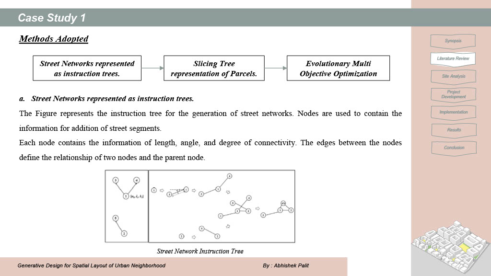

# Generative Design for Spatial Layout of Urban Neighborhood

This repository contains the dissertation project of **Abhishek Palit** submitted in partial fulfillment of the requirements for the **Master of Architecture** at **Indian Institute of Technology Roorkee**.

## 📄 Project Overview

The dissertation explores **Generative Design** techniques to optimize the spatial layout of urban neighborhoods. Using computational methods, the study aims to develop an algorithm that considers multiple urban design goals such as profit, open spaces, proximity, and shading to generate and evaluate design solutions. This algorithm has been applied to the **Salt Lake City, Kolkata** neighborhood as a case study.

## 🏙️ **Challenges in Urban Design**

The growing **global population** and **urbanization** have placed immense pressure on cities, making it more challenging for planners and architects to create sustainable, livable environments. With increasing **demand for land**, cities are expanding their boundaries and developing new neighborhoods that require **optimized layouts** for the well-being of their residents.

Urban design is a **multi-faceted process** involving several stakeholders, goals, and constraints, often making it difficult for planners and architects to achieve a balance. This project aims to address these challenges through a **Generative Algorithm** that outputs multiple **scenario-based designs**, helping stakeholders make informed decisions.

---

## 🎯 **Objective of the Study**

This dissertation focuses on creating a **Generative Design Algorithm** for two neighborhoods—**Block BD** and **Block CD**—in **Salt Lake City, Kolkata**, driven by multiple design goals. The algorithm explores layouts that optimize the following key metrics:

- **🏢 Profit** – Maximize the number of plots while minimizing roads.
- **🌳 Urban Quality** – Maximize open spaces.
- **🚶 Proximity** – Minimize distance to schools and open spaces.
- **🏖️ Urban Comfort** – Maximize shading in outdoor spaces for comfort.

---

## 🛠️ **How the Algorithm Works**

1. **Input Parameters**: 
   - Goals specified by stakeholders.
   - Environmental and spatial constraints.

2. **Generative Design Output**: 
   - Multiple design solutions that align with the specified goals.

3. **Performance Evaluation**: 
   - A **normalized metric** to compare the solutions.
   - Selection of the **top 10 high-performing layouts** based on their scores.

4. **Comparison with Existing Design**:
   - Evaluation of the **two best solutions** against the **current neighborhood layout**.
   - The results show that the **Generative Algorithm's designs outperform** the existing layout in various metrics.

---

## 📊 **Key Results**

- The algorithm generated **optimal designs** that balance profit, urban quality, proximity, and comfort.
- The top solutions provide **better outcomes** than the existing neighborhood design in Salt Lake City, demonstrating the **value of generative algorithms** in urban planning.
- Optimization Study: The generative design algorithm generated multiple solutions based on specified goals such as maximizing plots, minimizing road areas, and ensuring proximity to amenities.

---

## 🖼️ **Dissertation Presentation**

Below are some key slides from the **final dissertation presentation**, summarizing the study and its outcomes:

<!-- Presentation Gallery -->

